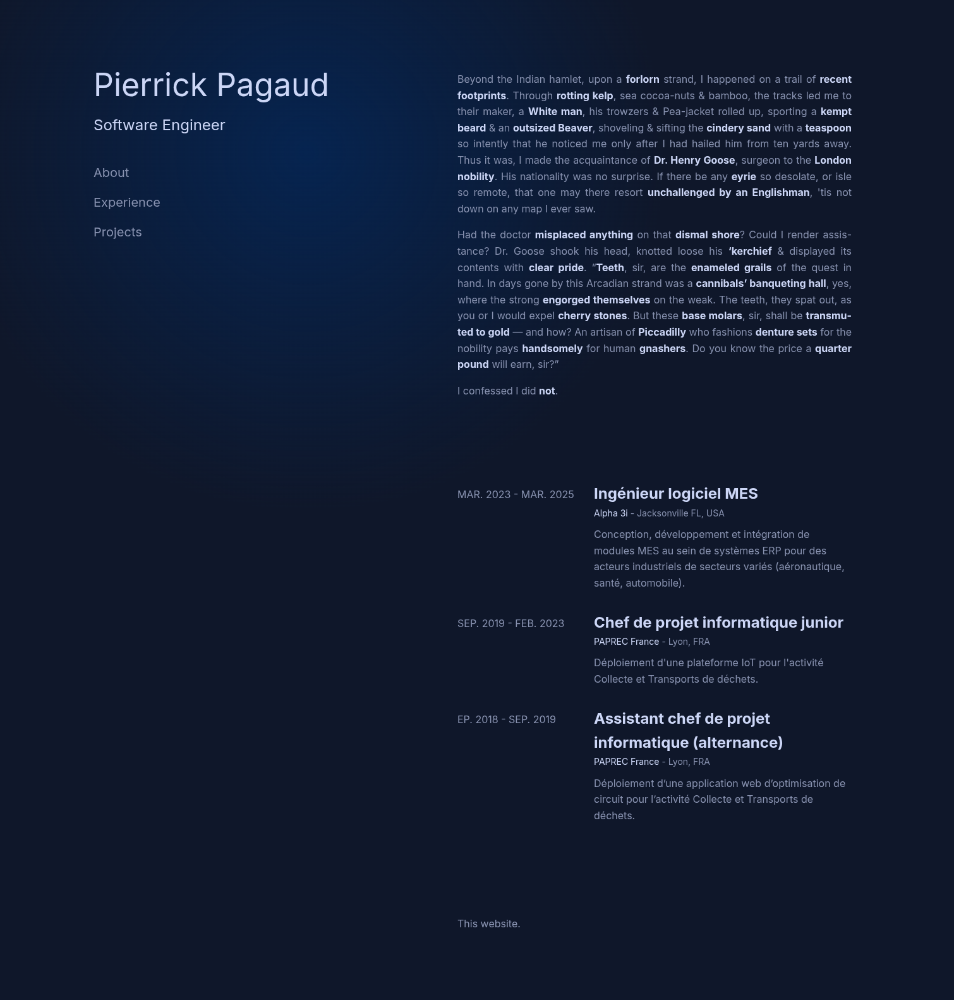

# 🚧 En cours de développement

# Django Portfolio Generator


> Application web modulaire pour créer, gérer et présenter des portfolios professionnels dynamiques.
> Conçue pour offrir une expérience utilisateur moderne, une architecture robuste et une grande extensibilité.

---

## 🧭 Table des matières

1. [🎥 Démonstration](#démonstration)
2. [🛠️ Technologies utilisées](#technologies-utilisées)
3. [📦 Modules](#modules)
4. [✨ Fonctionnalités principales](#-fonctionnalités)
5. [📆 Prérequis](#-prérequis)
6. [🚀 Installation](#-installation)
7. [🢑 Utilisation](#-utilisation)
8. [🚧 Roadmap](#-améliorations-possibles)
9. [💡 Cas d'usage](#-cas-dusage)
10. [👤 Auteurs](#-auteur)
11. [📄 Licence](#-licence)

---

## 🎥 Démonstration

Mon portfolio : https://portfolios-wjyf.onrender.com/pierrpgd/



---

## 🛠️ Technologies utilisées

**🔧 Backend :**

* Python 3.12
* Django 4.2
* PostgreSQL via Render / SQLite en version locale

**🎨 Frontend :**

* Bootstrap 5
* HTML5/CSS3 moderne
* JavaScript Vanilla (ES6+)
* jQuery 3.6

**🧰 Outils :**

* Bash pour le déploiement
* Render pour l'hébergement

---

## 📦 Modules

**🧠 Backend (Django)**

* **Modèles** :

  * `Profile` : Identité principale (nom, titre, identifiant unique)
  * `About` : Sections "À propos" modulaires
  * `Experience` : Parcours professionnel
  * `Project` : Réalisations/projets

* **Vues** :

  * Templates classiques (`portfolio`, `data_display`)
  * API RESTful : `load_data`, `save_data`, `delete_*`
  * Sécurité : permissions et CSRF

**🎨 Frontend**

* **Templates** :

  * `base.html` : Structure commune
  * `portfolio.html` : Affichage public (thème sombre)
  * `data_display.html` : Interface admin (thème clair)

* **JavaScript** :

  * Interactions utilisateur dynamiques
  * Communication via Fetch API
  * Modals, feedback visuel, drag & drop, édition en ligne

---

## ✨ Fonctionnalités

### Pour les visiteurs

* 💻 **Affichage responsive** des portfolios
* 🔀 **Navigation fluide** entre les sections
* 🎨 **Design moderne** avec effets visuels

### Pour les administrateurs

* 🛠️ **CRUD complet** via une interface conviviale
* 👥 **Gestion multi-profils**
* ✍️ **Édition en ligne** grâce à `contentEditable`
* 📦 **Réorganisation par glisser-déposer**
* 🔍 **Prévisualisation instantanée**
* ❌ **Suppression sécurisée** avec confirmation et retour visuel

---

## 📆 Prérequis

* Python **3.12**
* Git 2.43

---

## 🚀 Installation

```bash
# 1. Vérifiez l'installation des prérequis
python --version # v3.12 recommandé
git --version # v2.43 recommandé

# 2. Créez et activez un environnement virtuel
python -m venv portfolios-venv
source portfolios-venv/bin/activate  # sous Windows : portfolios-venv\Scripts\activate

# 3. Clonez le dépôt
git clone https://github.com/pierrpgd/portfolios.git
cd portfolios

# 4. Installez les dépendances
pip install -r requirements.txt

# 5. Initialisez la base de données
python manage.py makemigrations
python manage.py migrate

# 6. Lancez le serveur local
python manage.py runserver
```

* 🌐 **Interface publique** : http://localhost:8000/**votre-identifiant**
* 🔐 **Interface admin** : [http://localhost:8000/data/](http://localhost:8000/data/)

---

## 🢑 Utilisation

1. Connectez-vous à l’interface d’administration.
2. Créez un profil et sélectionnez-le.
3. Ajoutez vos sections "À propos", expériences et projets.
4. Modifiez, supprimez et réorganisez votre portfolio depuis l'interface admin.
5. Visualisez en temps réel le rendu final sur votre portfolio (http://localhost:8000/**votre-identifiant**).

---

## 🚧 Améliorations possibles

* 🌍 Internationalisation (i18n)
* 🔐 Authentification avancée
* 👁️ Prévisualisation en temps réel côté admin
* 📘 Historique des modifications (versioning)

---

## 💡 Cas d’usage

* Développeurs indépendants présentant leur parcours
* Écoles gérant les portfolios étudiants
* Agences ou cabinets RH
* Toute organisation souhaitant centraliser des profils professionnels

---

## 👤 Auteur

**Pierrick Pagaud** – [@pierrpgd](https://github.com/pierrpgd)

---

## 📄 Licence

Aucune, servez-vous :)
